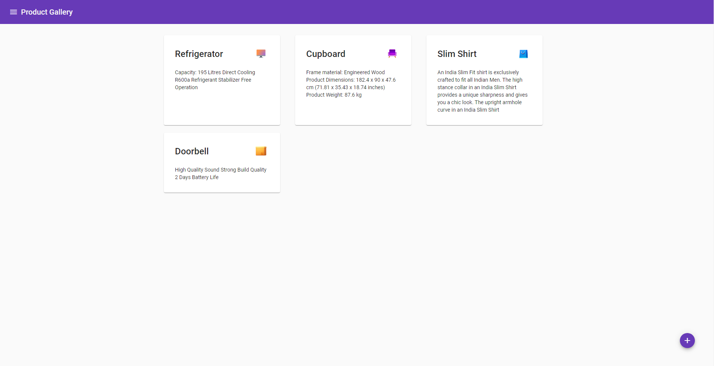
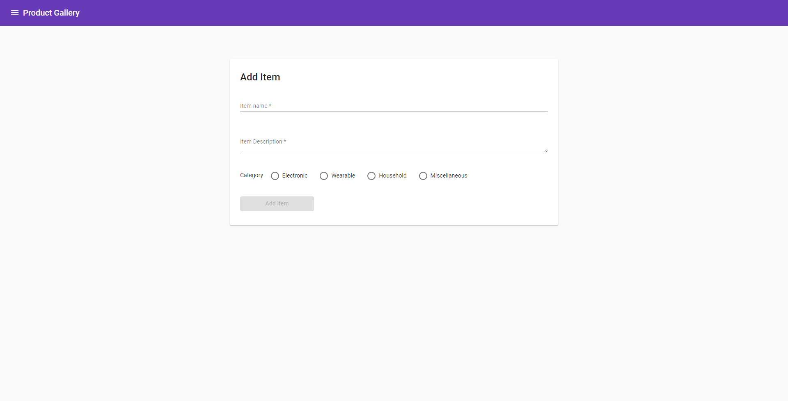
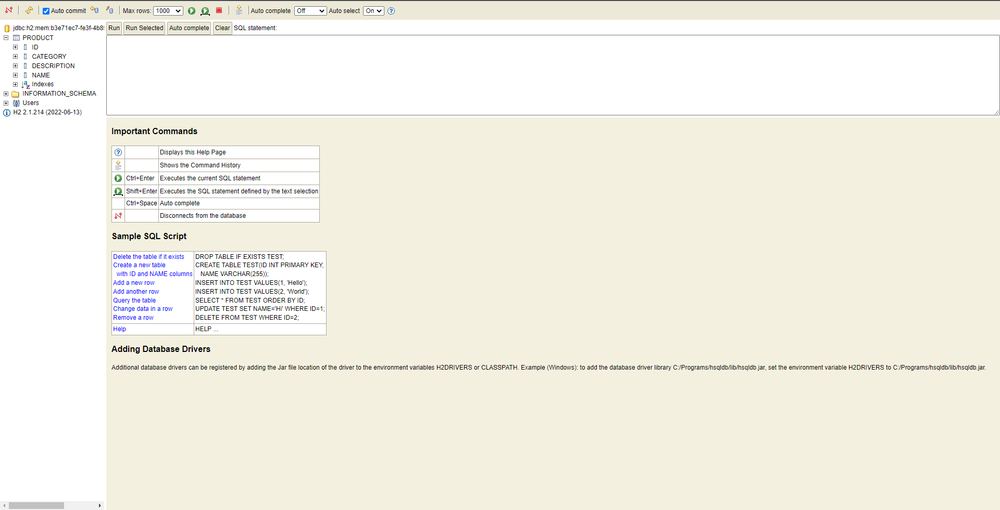

# Product Landing Page

### Context

This application is a combination of frontend and backend applicaton demo. User Interface is created using Angular while backend is created using Spring Boot. The app uses `REST API` to add and get all the data form the server, to store the data the Spring Boot uses `h2 database api`. The data stored is temprory and when application is closed the data is erased from the storge.

### Methods Usage
- **GetAll** - This method executes when the homepage is open it automatically fetch the data from the `h2 db` using `rest api` and display the data.
- **AddItem** - This method executes when used add an item using the form. It adds the data in `h2 database` using `http post request` and display success message if the data is saved.
- **SortItem** - This method executes when user click on the categeory icon which is on the top-right of each item. Item gets sorted according to the category and if clicked again the item is back to original form.

### API Usage
- Get - http://localhost:8080/api/v1/getAll
- Post - http://localhost:8080/api/v1/post

### Frontend Services

- [Angular CLI](https://github.com/angular/angular-cli) version 14.2.7.
- [FontAwosme](https://fontawesome.com/icons/) version 6.2.0
- [Angular Material](https://material.angular.io/) version 14.2.7
- [Product UI](./product/)

### Backend Services

- [Spring Boot](https://spring.io/projects/spring-boot) version 2.7.5
- [H2 Database](https://www.h2database.com/html/main.html) version 2.1.214
- [Boot Server](./server)

### API Services

- `REST API`
- [Postman](https://www.postman.com/) version 9.18.3

# Preview

### Home

### Add Item

# Database

### Run

To run angular application move your working directory to `/product` directory. and use the command.

- Angular - `ng serve`

To run the Spring boot REST API server move your working directory to `/server` use the below command. Make sure you have installed [Apache Maven](https://maven.apache.org/) before you run the below command.

- Server - `mvnspring-boot:run`

### Contributors
